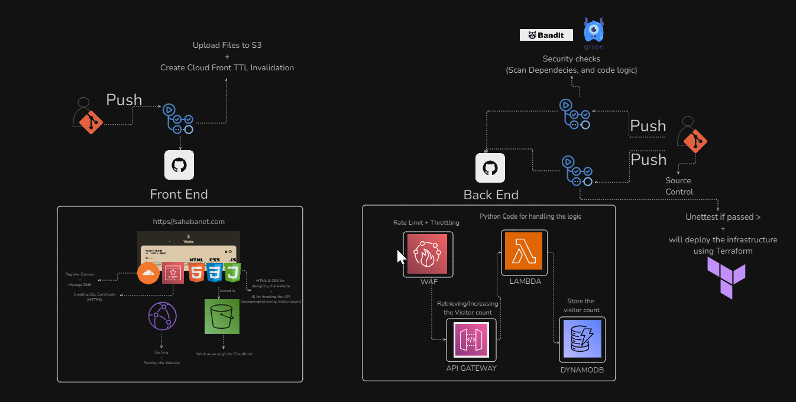
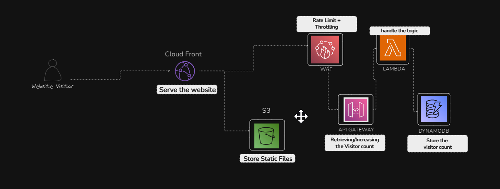

## 🧩 My Cloud Resume Challenge Implementation

This project is my implementation of the **Cloud Resume Challenge**, a practical, end-to-end cloud project that highlights my ability to design, build, and deploy serverless cloud-native architectures using modern DevOps practices.

⚠️ **Note**: The AWS infrastructure for this project has now been terminated.  
A simplified static site is currently hosted in this repository to indicate the termination.  

---

### 📷 How the Site Looked Before Termination

Previously, the live site was a fully deployed cloud-native application featuring:

- A **responsive static website** built with **HTML, CSS, and JavaScript**.
- A **live visitor counter** powered by a REST API built with **AWS Lambda** and **DynamoDB**.
- **S3 + CloudFront** for hosting and global content delivery.
- **Route 53 and ACM** for a custom domain, DNS, and SSL security.
- A secure **CI/CD pipeline** via GitHub Actions, with **Terraform** handling infrastructure deployment.
- Security hardening with **AWS WAF**, IAM least-privilege roles, and dependency scans.

The site dynamically updated the visitor count in real time and was served globally with low latency.

---

### 📷 Architecture Overview

---

### 🧱 Technologies Used

**Frontend (Static Site)**
- 🔤 HTML/CSS for structure and styling  
- 🧠 JavaScript to invoke API and reflect visitor count dynamically  
- 🪣 S3 for hosting static files  
- 🌐 CloudFront for global CDN and caching  
- 🔒 Route 53 + ACM for domain, DNS, and SSL  
- 🛠 GitHub Actions to deploy frontend + invalidate CloudFront TTL on push  

**Backend (Serverless API)**
- 🛡️ WAF to throttle and protect API Gateway  
- 🌐 API Gateway as a REST API entry point  
- 🐍 AWS Lambda (Python) to handle logic (read/increment count)  
- 💾 DynamoDB to store the visitor count  
- 🧪 GitHub Actions to:  
  - Run unit tests  
  - Perform security scans (via **Bandit** and **Grype**)  
  - Deploy infrastructure with Terraform upon success  
- 🔐 Git + OIDC for secure source control and AWS access  

---

### 🌟 What Made It Stand Out?

- ✔️ Built with Terraform modules and remote state for scalability  
- 🔄 CI/CD secured with **OIDC** – no static AWS credentials used  
- 🛡️ Emphasis on security with WAF, IAM least privilege, and dependency scanning  
- 🚀 Real-world architecture: previously powering a live portfolio site  
